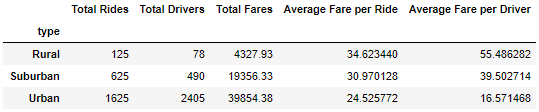
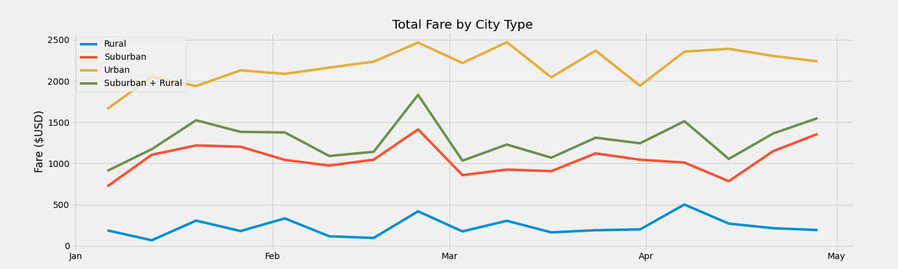

# PyBerAnalysis
## Purpose:
I was given a large amount of ride share data and asked calculate total fares, drivers, and rides for each city type. I then tasked with calculating the average fare per ride and average rides per driver for each city type. I went ahead and also calculated the average rides per driver. I have analyzed the data and included my report below.

## Results:
We tallied the total rides, total drivers, total fares, and calculated average fare per ride, average fare per driver, and average rides per driver; for each type of city. I have included the percentages of total by city type as well for an additional data point.

 - **Total Rides: 2375 (100%)**
   - Rural       125 (5.3%)
   - Suburban    625 (26.3%)
   - Urban       1,625 (68.4%)

 - **Total Drivers: 2,973 (100%)**
   - Rural       78 (2.6.%)
   - Suburban    490 (16.5%)
   - Urban       2,405 (80.9%)

 - **Total Fares: $63,538.64 (100%)**
   - Rural       $4,327.93 (6.8%)
   - Suburban    $19,356.33 (30.5%)
   - Urban       $39,854.38 (62.7%)

 - **Average Fares: ($26.75)**
   - Rural       $34.62
   - Suburban    $30.97
   - Urban       $24.53

 - **Average Fares per Driver: ($21.73)**
   - Rural       $55.49
   - Suburban    $39.50
   - Urban       $16.57

 - **Average # of Rides per Driver: (0.8)**
   - Rural       1.60
   - Suburban    1.28
   - Urban       0.68

## Summary:
### Urban Areas:
The Urban areas have signifficantly higher numbers when looking at total rides, drivers, and fares; but seem to have overall lower averages. While Urban areas have roughly 2/3 of the total rides and fares, they have roughly 4/5 of the total drivers. This would mean that there are not as many rides or fares for each driver in the Urban areas, which we can see reflected in the averages in Urban areas.

### Rural Areas:
Rural areas make up a very small percentage of the totals in rides and fares. While they may not be contributing as much to the overall statistics, Rural average fares and fares/rides per driver are much higher that other city types. This would mean that there are more rides and fares available for each driver in the Rural areas, as we can see reflected in the averages in Rural areas.

## Reccommendations:
### Rural Areas (Drivers):
Increase recruiting and marketing in Rural areas to try and get more divers available to pick up riders. Decreasing wait time will influence the likelihood that someone will use the service again, increasing the total number of rides in Rural areas and making the service more accessible.

### Rural Areas (Fares):
The average fare in Rural cities is much higher than in Urban cities. This might discourage people from using the ride-share service. Consider reducing the fare in Rural areas to make the service more affordable.

### Urban Areas (Drivers):
In Urban areas there are more drivers than there are rides. Inactive drivers could skew numbers to where there is less than one ride per driver in urban areas. Incorporate an inactivity function to remove inactive drivers from data to get more accurate results. Could also save money by reducing recruiting measures.

### Urban Areas (Total Fares):
The Urban areas account for roughly 63% of the total fares, more than Suburban and Rural cities combined. The urban areas are going to be the areas that will generate the most revenues for the company. Expanding the service to other Urban areas will likely be the greatest prospect for overall fiscal growth.

